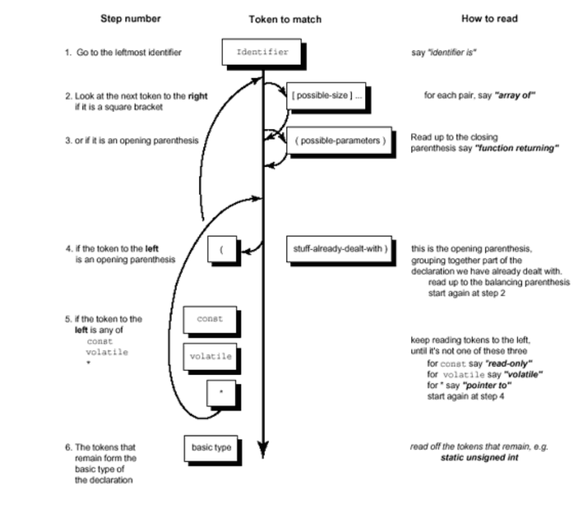

# c_declaration_decoder
A small decoder program as an initiative to understand how compiler decodes the declaration in C programming language based on the precedence rule

We assume that the declaration provided if syntactically correct, our decoder doesn't support syntax validations (as of now).

## How Declaration is formed!

### Definition of Declarator in C

| How many    | Name in C | How it looks in C |
| -------- | ------- | --- |
| zero or more  | pointers | `*`, `* const` |
| exactly one | direct_declarator | `identifier`, `identifier[size]`, `identifier(args...)`, `(declarator)` |
| zero or one    | initializer | `= initial_value` |

### Declaration in C

Below is the regular expression of a declaration in C.

```
<type-specifier> <type-qualifier>? <declarator>;
```

## Thumb Rule

Since this is just for learning and experimenting we can't be having a decoder supporting all the type and storage-class specifiers. Below are the supported type and storage-class specifiers we will support.

### Basic Data Type Specifier

- `int`
- `char`
- `void`

A declaration can have exactly one basic type, and it's always on the far left of the expression.

### Derived Types

- `*` a pointer to
- `[]` array of
- `()` function returning

### Type-specifier

- `const`

### Precedence Rule (operator precedence)

Always start with the variable name:

`foo is ...`

and always end with the basic type:

`foo is ... int`

The middle part is filled based on operator precedence rules:-

- parentheses grouping together parts of a declaration.
- the postfix operator: parentheses `()` indicating a function, and square brackets `[]` indicating an array.
- the prefix operator: the `*` denoting "pointer to".

### Decoder FSM




## Approach

### Tokenize


## Why Py

I prefer using python here because we are dealing with complex string operations like tokenizing, slicing, subarray matching etc.

## References

- http://unixwiz.net/techtips/reading-cdecl.html
- Expert C Programming - by Peter van der Linden
- https://medium.com/@bartobri/untangling-complex-c-declarations-9b6a0cf88c96
- https://user.ceng.metu.edu.tr/~ceng140/c_decl.pdf
